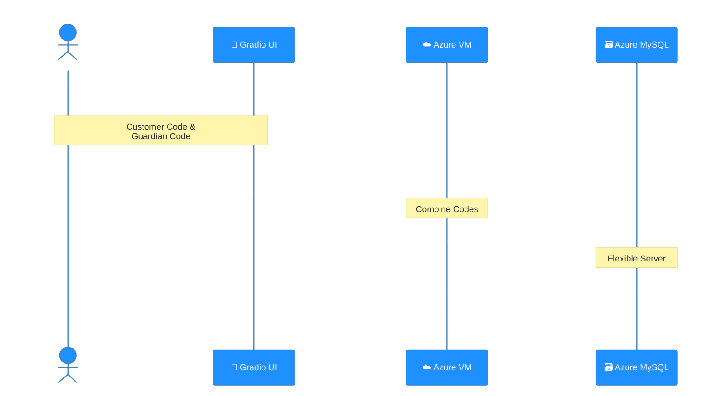
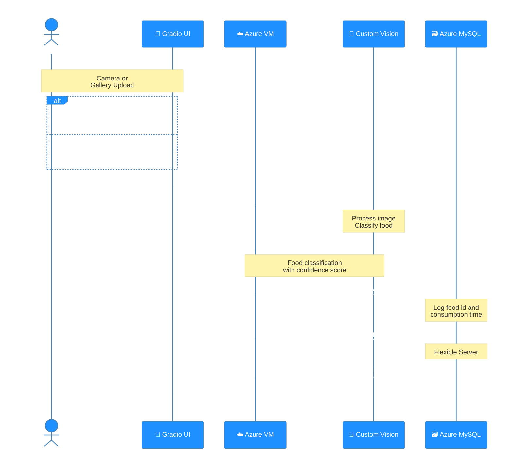

# 🍽️ LinQu - 시니어 대상 음식 이미지 인식 서비스

## 🌐 Service Information
| Type | URL | Status |
|------|-----|--------|
| Production | [nutricare.koreacentral.cloudapp.azure.com](https://nutricare.koreacentral.cloudapp.azure.com/) | 🟢 Active |

> **Note**: 서비스 문제 발생 시 [이슈](https://github.com/ms-five-guys/food-decoder/issues)를 생성해주세요.

## 📝 프로젝트 개요
Azure Custom Vision과 Azure Database for MySQL Flexible Server, Gradio를 활용한 시니어 대상 음식 이미지 인식 서비스입니다.

### 🎯 주요 기능
- 실시간 음식 이미지 인식 및 분류
- 개인별 영양 섭취 기록 관리
- 맞춤형 영양 정보 제공
- 일일/주간 영양 섭취 분석

## 🛠️ Tech Stack

### 🎨 Interface
- 🖥️ Gradio (Python UI Library)
- 📊 Matplotlib (Data Visualization)
- 🎯 OpenCV (Image Processing)

### ⚙️ Backend
- 🐍 Python 3.9+
- 🧠 Azure Custom Vision (ML Model)
- 🗃️ Azure Database for MySQL Flexible Server (Database)

### 🔧 DevOps
- ☁️ Azure VM (Cloud Platform)
- 🚀 GitHub Actions with Secret Management (Continuous Deployment)
- 😜 [Gitmoji](https://gitmoji.dev/) (Commit Convention)

## 📁 프로젝트 구조
```
food_classifier/
├── custom_vision/                   # Azure Custom Vision
├── docs/                            # 문서
├── experiments/                     # 실험 결과
├── food_classifier/
│   ├── src/
│   │   ├── service_ui/              # Gradio UI 컴포넌트
│   │   │   ├── clients/             # 외부 서비스 통신
│   │   │   │   ├── ml_client.py     # Azure Custom Vision 통신
│   │   │   │   ├── db_client.py     # Azure Database for MySQL DB Flexible Server 통신
│   │   │   ├── components/          # UI 컴포넌트
│   │   │   │   ├── interfaces/      # 인터페이스 정의
│   │   │   │   ├── utils/           # UI 유틸리티
│   │   │   └── app.py               # 메인 UI 애플리케이션
└── requirements.txt                 # 프로젝트 의존성
```

## 📊 System Interaction Flow
이 섹션은 `service_ui` 모듈을 통해 사용자와 시스템 간의 상호작용을 두 가지 주요 흐름으로 설명합니다. 첫 번째 흐름은 고객 정보와 최근 영양 성분 섭취 정보를 조회하는 과정이며, 두 번째 흐름은 이미지를 처리하여 영양 정보를 제공하는 과정입니다.

### 1. 📊 고객 정보 조회 (Customer Information Retrieval)
이 다이어그램은 사용자가 Gradio UI를 통해 고객 코드와 보호자 코드를 입력하여 데이터베이스에서 고객 정보와 최근 5일치 영양 성분 섭취 정보를 조회하는 과정을 설명합니다. 조회된 정보는 사용자에게 표시됩니다.



### 2. 📊 영양 정보 분석 (Nutrition Information Analysis)
이 다이어그램은 사용자가 음식 이미지를 제출하면 영양 정보를 분석하고 표시하는 과정을 설명합니다. 사용자는 카메라로 촬영하거나 갤러리에서 이미지를 선택할 수 있으며, Custom Vision이 음식을 식별합니다. 분석된 결과는 일일 권장 영양소 대비 섭취량을 막대 그래프로 시각화하고, 오늘 섭취한 음식 기록을 함께 표시합니다.



## 🤝 Contributing
프로젝트 기여 방법은 [CONTRIBUTING.md](.github/CONTRIBUTING.md)를 참고해주세요.

## 👥 Team Five Guys
- 김기덕 [@GideokKim](https://github.com/GideokKim) - ML/Backend
- 이희주 [@YiHeeJu](https://github.com/YiHeeJu) - Frontend/UI
- 윤소영 [@Yoonsoyoung02](https://github.com/Yoonsoyoung02) - Database
- 박현열 [@yoplnaa](https://github.com/yoplnaa) - DevOps
- 김민석 [@BrianK64](https://github.com/BrianK64) - Testing

## 📞 Support
문제가 있으시다면 [이슈](../../issues)를 생성해주세요.
