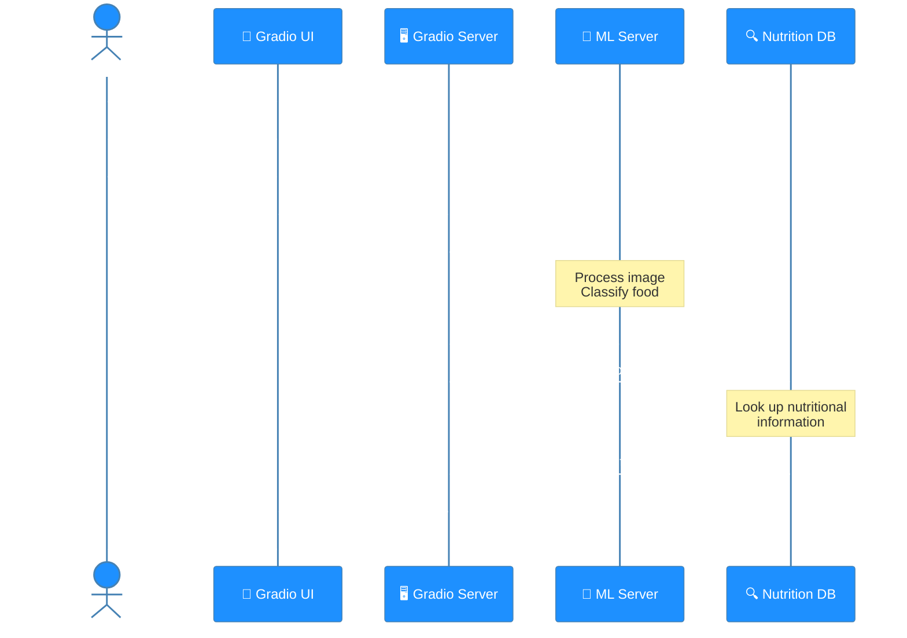

# 🧠 CNN 기반 실시간 음식 인식 프로젝트

## 📝 프로젝트 개요
- CNN 기반 음식 인식 모델을 개발하여 실시간으로 음식을 분석하고 영양 성분 정보를 제공하는 시스템
- Azure를 활용한 클라우드 기반 서비스 구축
- Git을 통한 버전 관리 및 협업

## 🚀 시작하기

### 필수 요구사항
- Python 3.9 이상
- Git

## 📁 프로젝트 구조
```
project/
│
├── models/            # 학습된 모델 파일
├── src/               # 소스 코드
├── experiments/       # 실험 결과
├── requirements.txt   # 프로젝트 의존성
└── README.md          # 프로젝트 문서
```

## 🛠️ 주요 기능
- 실시간 음식 이미지 인식
- 영양 성분 정보 제공
- 데이터베이스 검색 및 관리

## 📊 System Interaction Flow
이 다이어그램은 `service_ui` 모듈을 통해 사용자와 시스템 간의 상호작용을 설명합니다. 사용자가 Gradio UI를 통해 사진을 캡처하면, Gradio Server는 ML Server에 이미지를 전송하여 음식 이름을 예측합니다. 예측된 음식 이름은 Nutrition DB에 쿼리되어 영양 정보를 가져오고, 최종 결과는 사용자에게 표시됩니다.



## 📚 참고 자료
- [프로젝트 위키](https://github.com/ms-five-guys/food-decoder/wiki)
- [문제 해결 가이드](https://github.com/ms-five-guys/food-decoder/wiki)

## 📝 라이선스
이 프로젝트는 [라이선스명] 라이선스를 따릅니다. 자세한 내용은 `LICENSE` 파일을 참고하세요.

## ✨ 팀원
- 김기덕 - [GitHub](https://github.com/GideokKim)
- 이희주 - [GitHub](https://github.com/YiHeeJu)
- 윤소영 - [GitHub](https://github.com/Yoonsoyoung02)
- 박현열 - [GitHub](https://github.com/yoplnaa)
- 김민석 - [GitHub](https://github.com/BrianK64)
