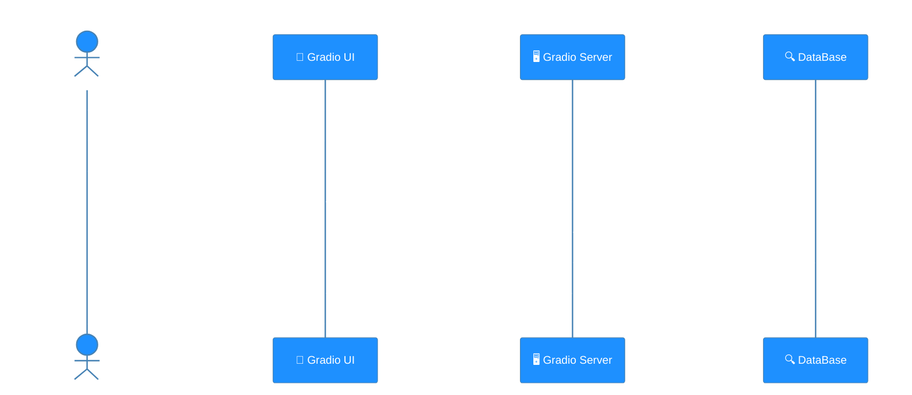
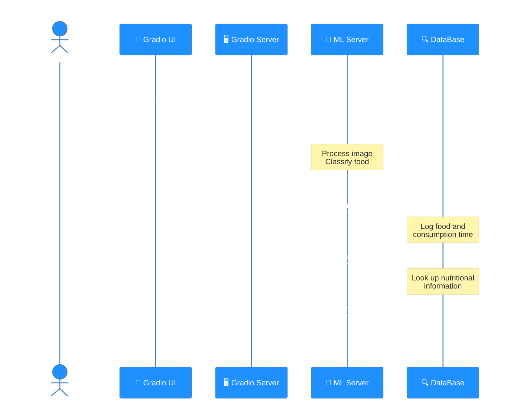

# 🧠 CNN 기반 실시간 음식 인식 프로젝트

## 📝 프로젝트 개요
- CNN 기반 음식 인식 모델을 개발하여 실시간으로 음식을 분석하고 영양 성분 정보를 제공하는 시스템
- Azure를 활용한 클라우드 기반 서비스 구축
- Git을 통한 버전 관리 및 협업

## 🚀 시작하기

### 필수 요구사항
- Python 3.9 이상
- Git

## 📁 프로젝트 구조
```
project/
│
├── models/            # 학습된 모델 파일
├── src/               # 소스 코드
├── experiments/       # 실험 결과
├── requirements.txt   # 프로젝트 의존성
└── README.md          # 프로젝트 문서
```

## 🛠️ 주요 기능
- 실시간 음식 이미지 인식
- 영양 성분 정보 제공
- 데이터베이스 검색 및 관리

## 📊 System Interaction Flow
이 섹션은 `service_ui` 모듈을 통해 사용자와 시스템 간의 상호작용을 두 가지 주요 흐름으로 설명합니다. 첫 번째 흐름은 고객 정보와 최근 영양 성분 섭취 정보를 조회하는 과정이며, 두 번째 흐름은 이미지를 처리하여 영양 정보를 제공하는 과정입니다.

### 1. 📊 Customer Information and Nutrition Retrieval
이 다이어그램은 사용자가 Gradio UI를 통해 고객 코드를 입력하여 데이터베이스에서 고객 정보와 최근 5일치 영양 성분 섭취 정보를 조회하는 과정을 설명합니다. 조회된 정보는 사용자에게 표시됩니다.



### 2. 📊 Image Processing and Nutrition Information
이 다이어그램은 사용자가 Gradio UI를 통해 사진을 캡처하면, Gradio Server가 ML Server에 이미지를 전송하여 음식 이름을 예측하고, 예측된 음식 이름을 기반으로 데이터베이스에서 영양 정보를 조회하는 과정을 설명합니다. 최종 결과는 사용자에게 표시됩니다.



## 📚 참고 자료
- [프로젝트 위키](https://github.com/ms-five-guys/food-decoder/wiki)
- [문제 해결 가이드](https://github.com/ms-five-guys/food-decoder/wiki)

## 📝 라이선스
이 프로젝트는 [라이선스명] 라이선스를 따릅니다. 자세한 내용은 `LICENSE` 파일을 참고하세요.

## ✨ 팀원
- 김기덕 - [GitHub](https://github.com/GideokKim)
- 이희주 - [GitHub](https://github.com/YiHeeJu)
- 윤소영 - [GitHub](https://github.com/Yoonsoyoung02)
- 박현열 - [GitHub](https://github.com/yoplnaa)
- 김민석 - [GitHub](https://github.com/BrianK64)
