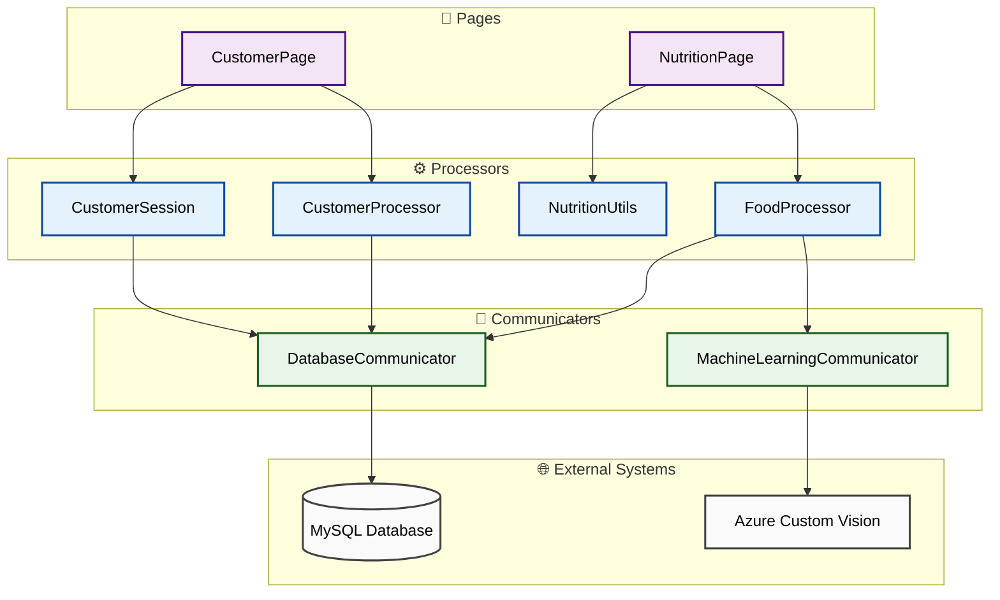

# 🎨 식단 관리 서비스 UI 아키텍처

## 1. 📱 서비스 개요

### 1.1 주요 기능
- 고객 정보 조회 및 관리
- 음식 이미지 분석
- 영양 정보 추적 및 시각화
- 실시간 섭취량 모니터링

### 1.2 기술 스택
- UI: Python with Gradio

## 2. 🏗️ UI 구조

### 2.1 디렉터리 구조
```
service_ui/
├── app.py                 # 메인 애플리케이션
├── communicators/         # 외부 시스템 통신 모듈
├── pages/                 # UI 페이지 모듈
└── processors/            # 데이터 처리 모듈
```

### 2.2 주요 모듈
1. **외부 시스템 연동 모듈**
   - `CustomVisionCommunicator`: Azure Custom Vision 연동
   - `CustomerDataCommunicator`: MySQL 데이터베이스 연동

2. **페이지 모듈**
   - `CustomerPage`: 고객 정보 관리 화면
   - `NutritionPage`: 영양 정보 관리 화면

3. **데이터 처리 모듈**
   - `CustomerProcessor`: 고객 정보 처리 및 시각화
   - `FoodProcessor`: 음식 이미지 분석 및 영양 정보 처리
   - `CustomerSession`: 고객 세션 관리
   - `NutritionUtils`: 영양 정보 표시 및 계산

### 2.3 모듈 구성도



## 3. ✨ 페이지별 주요 기능

### 3.1 고객 정보 페이지
- 고객/보호자 코드 기반 로그인
- 고객 프로필 표시
  - 기본 정보 (이름, 나이, 성별 등)
- 영양 섭취 요약 대시보드

### 3.2 영양 관리 페이지
- 음식 이미지 분석 기능
  - 실시간 이미지 업로드
  - AI 기반 음식 분류
  - 영양 성분 자동 계산
- 섭취량 모니터링
  - 일일 권장량 대비 현재 섭취량
  - 과다 섭취 시 경고 알림

## 4. 📊 시각화 컴포넌트

### 4.1 영양 섭취 그래프
- 최근 5일 섭취 트렌드
  - 일별 주요 영양소 섭취량
  - 권장 섭취량 범위 표시
- 영양소별 섭취 현황
  - 과다/과소 섭취 경고
  - 권장 섭취 구간 표시

### 4.2 실시간 모니터링
- 일일 섭취량 진행바
  - 영양소별 색상 구분
  - 실시간 업데이트
- 경고 알림 시스템
  - 과다 섭취 경고
